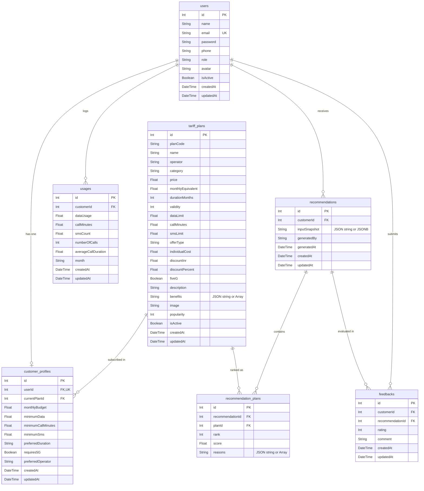
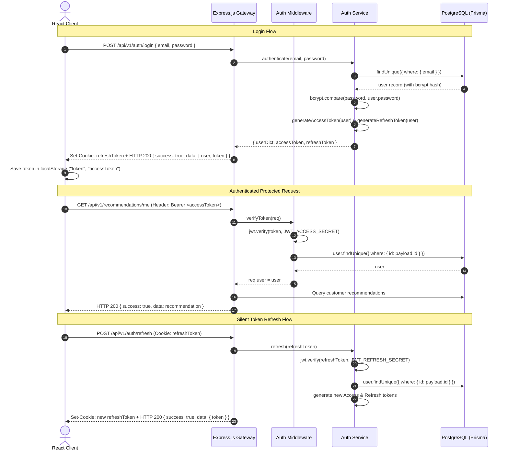
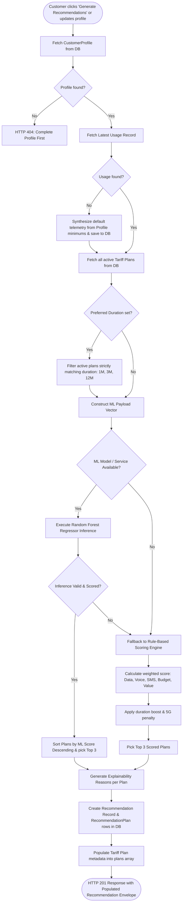
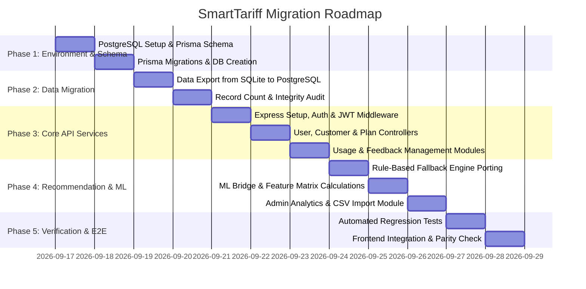

# SmartTariff — Complete System Architecture & Migration Plan
**FastAPI + SQLite + SQLAlchemy + Pydantic ➔ Node.js + Express.js + PostgreSQL + Prisma ORM**

---

## Executive Summary
This document provides an exhaustive, production-grade migration plan to transition the **SmartTariff** backend from a Python/FastAPI/SQLite stack to an enterprise Node.js/Express/PostgreSQL/Prisma stack, while preserving **100% compatibility** with the existing React frontend and maintaining exact mathematical parity with the **SmartTariff V4.3 Random Forest ML recommendation engine**.

---

## Section A: Current Architecture

### 1. High-Level Topology

```mermaid
graph TD
    Client["React 19 Frontend (Vite 7, Tailwind 4, Redux Toolkit)\nPort: 5173 / 3000"]
    API["FastAPI 0.115.6 Gateway (Uvicorn, Port 8000)\nPrefix: /api/v1"]
    Auth["JWT HS256 + Bcrypt Security\nCookie: refreshToken | Bearer: accessToken"]
    Engine["Recommendation Orchestrator\napp/services/recommendation_service.py"]
    ML["ML Inference Engine (Scikit-Learn V4.3)\napp/services/ml_service.py\nsmarttariff_v4_3_random_forest.pkl (8.65 MB)"]
    Fallback["Rule-Based Scoring Engine\n(Weights: 40% Data, 25% Calls, 10% SMS, 15% Budget, 10% Value)"]
    DB[("SQLite 3 Database (smarttariff.db)\n7 Tables | 21 Users | 20 Plans")]

    Client -->|HTTP REST + Bearer Token| API
    API --> Auth
    API --> Engine
    Engine -->|Primary Inference| ML
    Engine -->|Fallback on failure| Fallback
    API --> DB
    Engine --> DB
```


### 2. Frontend Folder Structure
```text
smartTariff-frontend-main/
├── index.html
├── package.json               # React 19.2.6, Vite 7.3.2, Redux Toolkit 2.12.0, Recharts 3.10.1, Tailwind 4.1.17
├── public/
├── src/
│   ├── App.tsx                # App entry, Redux Provider, BrowserRouter, Route declarations, AuthBootstrap
│   ├── index.css              # Tailwind CSS base styles
│   ├── components/
│   │   ├── charts/            # UsageChart.jsx (Recharts telemetry visualization)
│   │   ├── common/            # Button, Input, Select, Toggle, Modal, Card, Badge, Pagination, Loader, Logo
│   │   ├── dashboard/         # CustomerUsageCards, CustomerProfileModal, RecommendationCard, SavingsSummary, UsageVsPlan
│   │   ├── layout/            # Header, Sidebar, Footer, PublicNavbar
│   │   ├── plans/             # PlanCard
│   │   └── recommendations/   # RecommendationCard
│   ├── hooks/
│   │   └── useAuth.js         # Custom hook exposing user, token, role booleans (isCustomer, isAdmin)
│   ├── layouts/
│   │   ├── DashboardLayout.jsx # Role-aware dashboard shell (variant: customer | admin)
│   │   └── PublicLayout.jsx    # Public navigation wrapper
│   ├── mockApi/               # Legacy prototype in-memory database & mock engine (deprecated)
│   ├── pages/
│   │   ├── LandingPage.jsx
│   │   ├── NotFoundPage.jsx
│   │   ├── auth/              # LoginPage.jsx, RegisterPage.jsx
│   │   ├── customer/          # DashboardPage, UsagePage, HistoryPage, ProfilePage, PreferencesPage, ComparePage
│   │   ├── plans/             # PlansPage.jsx, PlanDetailsPage.jsx
│   │   └── admin/             # AdminDashboardPage, AdminCustomersPage, AdminPlansPage, AdminUsagePage, AdminFeedbackPage, AdminSettingsPage
│   ├── routes/
│   │   └── ProtectedRoute.jsx # Role-based router guard (redirects unauthenticated users to /login)
│   ├── services/
│   │   ├── api.js             # Central fetch client, token management, error formatting
│   │   ├── authApi.js         # /api/v1/auth routes
│   │   ├── customerApi.js     # /api/v1/customers & /api/v1/users routes
│   │   ├── planApi.js         # /api/v1/plans routes
│   │   ├── usageApi.js        # /api/v1/usage routes
│   │   ├── recommendationApi.js # /api/v1/recommendations routes
│   │   ├── feedbackApi.js     # /api/v1/feedback routes
│   │   └── adminApi.js        # /api/v1/admin routes
│   ├── store/
│   │   ├── store.js           # Redux configureStore
│   │   └── slices/            # authSlice, planSlice, usageSlice, recommendationSlice
│   └── utils/
│       ├── cn.ts              # Class name merger (clsx + tailwind-merge)
│       ├── csv.js             # Client-side CSV generator/downloader
│       ├── format.js          # Currency, data GB, minutes, date formatters
│       └── seedInit.js        # No-op placeholder
```

### 3. Backend Folder Structure
```text
smartTariff-backend-main/
├── api/
│   └── index.py               # Vercel serverless entrypoint
├── app/
│   ├── __init__.py
│   ├── config.py              # Pydantic BaseSettings (port, jwt, db_url, ml settings)
│   ├── database.py            # SQLAlchemy engine, SessionLocal, Base, get_db(), create_tables()
│   ├── dependencies.py        # Token creation, cookie helpers, get_current_user, require_admin
│   ├── models/
│   │   ├── __init__.py
│   │   ├── user.py            # User model with bcrypt set_password/verify_password
│   │   ├── customer_profile.py# CustomerProfile model (budget, data, call, SMS, 5G, duration)
│   │   ├── tariff_plan.py     # TariffPlan model with JSON benefits
│   │   ├── usage.py           # Usage monthly telemetry model
│   │   ├── recommendation.py  # Recommendation & RecommendationPlan normalized models
│   │   └── feedback.py        # Feedback ratings (1-5) and comments
│   ├── schemas/
│   │   ├── __init__.py
│   │   ├── auth.py            # RegisterRequest, LoginRequest
│   │   ├── user.py            # UpdateUserRequest, UpdateProfileRequest
│   │   ├── plan.py            # CreatePlanRequest, UpdatePlanRequest
│   │   ├── usage.py           # CreateUsageRequest, UpdateUsageRequest
│   │   └── feedback.py        # SubmitFeedbackRequest
│   ├── routers/
│   │   ├── __init__.py
│   │   ├── auth.py            # /api/v1/auth (register, login, logout, me, refresh)
│   │   ├── users.py           # /api/v1/users (me, update, delete)
│   │   ├── customers.py       # /api/v1/customers (me/profile)
│   │   ├── plans.py           # /api/v1/plans (CRUD + search & filters)
│   │   ├── usage.py           # /api/v1/usage (me, latest, create, update)
│   │   ├── recommendations.py # /api/v1/recommendations (model-status, predict, generate, me, history, id)
│   │   ├── feedback.py        # /api/v1/feedback (submit, me)
│   │   └── admin.py           # /api/v1/admin (dashboard, customers, usage, feedback, import)
│   └── services/
│       ├── __init__.py
│       ├── ml_service.py      # Random Forest model loading, 11 feature calculations, score bounding
│       └── recommendation_service.py # Orchestrator + rule-based fallback engine
├── check_db.py                # Database diagnostic CLI script
├── main.py                    # FastAPI root application, CORS middleware, global exception handler
├── requirements.txt           # Python dependencies
├── smarttariff.db             # SQLite database file (88 KB, 7 tables, 21 users, 20 plans)
├── smarttariff_v4_3_config.json # V4.3 model configuration and evaluation metrics
├── smarttariff_v4_3_random_forest.pkl # Pre-trained Scikit-learn RandomForestRegressor (8.65 MB)
├── start.bat                  # Windows startup batch script
└── vercel.json                # Vercel deployment configuration
```

---

## Section B: Target Architecture

### 1. Technology Stack
| Layer | Existing Stack | Target Stack | Rationale |
| :--- | :--- | :--- | :--- |
| **Runtime** | Python 3.12 (CPython) | Node.js (v20+ LTS) | High-throughput asynchronous I/O, unified JS/TS ecosystem across frontend & backend |
| **Framework** | FastAPI 0.115.6 + Uvicorn | Express.js 4.21+ (or 5.x) | Battle-tested, idiomatic Node.js HTTP framework with modular middleware chaining |
| **Database** | SQLite 3 (File-based) | PostgreSQL (v15+ / 16+) | Full ACID compliance, connection pooling, native concurrency, JSONB indexing, production stability |
| **ORM / Data Layer**| SQLAlchemy 2.0 (Declarative) | Prisma ORM 5.x / 6.x | Type-safe queries, auto-generated migrations, intuitive relations, zero raw-SQL mapping boilerplate |
| **Validation Layer**| Pydantic v2 | Zod (v3.23+) | Runtime schema validation with automatic TypeScript inference and identical constraint validation |
| **Authentication** | python-jose + passlib (bcrypt) | jsonwebtoken + bcryptjs / bcrypt | Industry-standard JWT signing/verifying with identical HS256 algorithm and cookie semantics |
| **ML Serving** | In-process Python Joblib | Hybrid: Python Micro-worker OR ONNX Runtime (`onnxruntime-node`) | Native model execution with zero loss in prediction accuracy or feature engineering math |

### 2. Target Backend Directory Structure
```text
smartTariff-backend-node/
├── .env.example
├── .env
├── package.json
├── tsconfig.json              # TypeScript compilation setup
├── prisma/
│   ├── schema.prisma          # Prisma schema with all 7 models, foreign keys, and indexes
│   └── seed.ts                # Seed script populating admin, 20 customers, 20 plans, usages, recs
├── src/
│   ├── server.ts              # Server bootstrap, port listening, graceful shutdown
│   ├── app.ts                 # Express app setup, CORS, cookie-parser, JSON parsing, error handler
│   ├── config/
│   │   └── env.ts             # Zod-validated environment variables
│   ├── prisma.ts              # Shared PrismaClient singleton instance
│   ├── middlewares/
│   │   ├── auth.middleware.ts # JWT verification (Bearer token extraction)
│   │   ├── role.middleware.ts # requireAdmin authorization guard
│   │   ├── validate.middleware.ts # Zod request body/query validator
│   │   └── error.middleware.ts# Global exception handler matching FastAPI envelope
│   ├── models/                # TypeScript interface representations
│   ├── schemas/               # Zod validation schemas matching Pydantic schemas
│   │   ├── auth.schema.ts
│   │   ├── customer.schema.ts
│   │   ├── plan.schema.ts
│   │   ├── usage.schema.ts
│   │   └── feedback.schema.ts
│   ├── controllers/           # HTTP Request/Response controllers
│   │   ├── auth.controller.ts
│   │   ├── user.controller.ts
│   │   ├── customer.controller.ts
│   │   ├── plan.controller.ts
│   │   ├── usage.controller.ts
│   │   ├── recommendation.controller.ts
│   │   ├── feedback.controller.ts
│   │   └── admin.controller.ts
│   ├── routes/                # Express router definitions
│   │   ├── index.ts           # Central router mounting all modules under /api/v1
│   │   ├── auth.routes.ts
│   │   ├── user.routes.ts
│   │   ├── customer.routes.ts
│   │   ├── plan.routes.ts
│   │   ├── usage.routes.ts
│   │   ├── recommendation.routes.ts
│   │   ├── feedback.routes.ts
│   │   └── admin.routes.ts
│   ├── services/
│   │   ├── auth.service.ts
│   │   ├── user.service.ts
│   │   ├── plan.service.ts
│   │   ├── usage.service.ts
│   │   ├── recommendation.service.ts # Primary recommendation orchestration
│   │   ├── rule_engine.service.ts   # Rule-based fallback scoring engine
│   │   └── ml_engine.service.ts     # ML inference bridge & feature calculation pipeline
│   └── utils/
│       ├── response.ts        # apiSuccess({ success: true, message, data }) formatter
│       ├── tokens.ts          # createAccessToken, createRefreshToken, cookie helpers
│       └── formatters.ts      # Model-to-Dict camelCase / _id converters
├── ml_service/                # Python ML runner or ONNX model artifact
│   ├── smarttariff_v4_3_random_forest.pkl
│   ├── smarttariff_v4_3_config.json
│   └── predict_runner.py      # Microservice or CLI stdio bridge for model inference
└── test/
    ├── auth.test.ts
    ├── plans.test.ts
    ├── recommendations.test.ts
    └── ml_engine.test.ts
```

---

## Section C: Complete API Inventory

The FastAPI backend exposes **38 total endpoints**. In the target Express backend, all 38 endpoints will be recreated with identical URLs, HTTP methods, status codes, and JSON response envelopes, with **3 additional frontend-requested routes** implemented to fix gaps identified in the original FastAPI backend.

### Standard Response Envelope
All successful endpoints must return:
```json
{
  "success": true,
  "message": "Descriptive message",
  "data": { ... }
}
```
All error responses must return:
```json
{
  "success": false,
  "message": "Error description"
}
```

### Route-by-Route Specification Table

| # | Method | Endpoint | Auth / Role | Request Body | Query Parameters | Response Structure | Purpose |
|---|---|---|---|---|---|---|---|
| 1 | `GET` | `/` | Public | None | None | `{ success, message, docs, health, version }` | System root |
| 2 | `GET` | `/api/v1/health` | Public | None | None | `{ success, message, timestamp, environment }` | Health check probe |
| 3 | `POST` | `/api/v1/auth/register` | Public | `{ name, email, password, phone? }` | None | `{ success, message, data: { user, token } }` + `Set-Cookie: refreshToken` | Customer signup |
| 4 | `POST` | `/api/v1/auth/login` | Public | `{ email, password }` | None | `{ success, message, data: { user, token } }` + `Set-Cookie: refreshToken` | User authentication |
| 5 | `POST` | `/api/v1/auth/logout` | Public | None | None | `{ success, message }` + Clear `refreshToken` cookie | Invalidate session |
| 6 | `GET` | `/api/v1/auth/me` | Bearer Token | None | None | `{ success, data: user }` | Fetch authenticated user |
| 7 | `POST` | `/api/v1/auth/refresh` | Cookie `refreshToken` | None | None | `{ success, message, data: { token } }` + New `refreshToken` cookie | Refresh access token |
| 8 | `GET` | `/api/v1/users/me` | Bearer Token | None | None | `{ success, data: user }` | Fetch user info |
| 9 | `PATCH` | `/api/v1/users/me` | Bearer Token | `{ name?, phone?, avatar? }` | None | `{ success, message, data: user }` | Update user personal details |
| 10 | `DELETE` | `/api/v1/users/me` | Bearer Token | None | None | `{ success, message }` | Delete current user & cascade all records |
| 11 | `GET` | `/api/v1/customers/me/profile` | Bearer Token | None | None | `{ success, data: customerProfile }` | Fetch customer preferences & budget |
| 12 | `PATCH` | `/api/v1/customers/me/profile` | Bearer Token | `{ monthlyBudget?, minimumData?, minimumCallMinutes?, minimumSms?, preferredDuration?, requires5G?, preferredOperator?, currentPlan? }` | None | `{ success, message, data: customerProfile }` | Update customer preferences |
| 13 | `GET` | `/api/v1/plans` | Public | None | `page, limit, search, operator, category, minPrice, maxPrice, minData, fiveG, status, sortBy` | `{ success, data: { docs: [], page, limit, totalDocs, totalPages, hasNextPage, hasPrevPage } }` | List catalog plans with pagination & filtering |
| 14 | `GET` | `/api/v1/plans/:id` | Public | None | None | `{ success, data: plan }` | Get single plan by ID |
| 15 | `POST` | `/api/v1/plans` | Admin Only | `{ planCode?, name, operator?, category?, price, monthlyEquivalent?, durationMonths?, validity, dataLimit?, callMinutes?, smsLimit?, offerType?, individualCost?, discountInr?, discountPercent?, fiveG?, description?, benefits?: string[], image?, popularity?, isActive? }` | None | `{ success, message, data: plan }` (HTTP 201) | Create new tariff plan |
| 16 | `PATCH` | `/api/v1/plans/:id` | Admin Only | Partial `UpdatePlanRequest` | None | `{ success, message, data: plan }` | Update tariff plan |
| 17 | `PUT` | `/api/v1/plans/:id` | Admin Only | Full/Partial `UpdatePlanRequest` | None | `{ success, message, data: plan }` | Alias for PATCH (frontend compatibility) |
| 18 | `DELETE` | `/api/v1/plans/:id` | Admin Only | None | None | `{ success, message, data: plan }` | Soft-deactivate tariff plan |
| 19 | `GET` | `/api/v1/plans/categories` | Public | None | None | `{ success, data: string[] }` | List distinct plan categories (frontend support) |
| 20 | `GET` | `/api/v1/usage/me` | Bearer Token | None | `page, limit, month` | `{ success, data: { docs: [], page, limit, totalDocs, totalPages, hasNextPage, hasPrevPage } }` | Get authenticated customer usage history |
| 21 | `GET` | `/api/v1/usage/me/latest` | Bearer Token | None | None | `{ success, data: usage \| null }` | Get latest telemetry record |
| 22 | `POST` | `/api/v1/usage` | Bearer Token | `{ dataUsage, callMinutes, smsCount, numberOfCalls?, averageCallDuration?, month }` | None | `{ success, message, data: usage }` (HTTP 201) | Add customer usage record |
| 23 | `PATCH` | `/api/v1/usage/:id` | Bearer Token | Partial `UpdateUsageRequest` | None | `{ success, message, data: usage }` | Edit usage record |
| 24 | `GET` | `/api/v1/recommendations/model-status` | Public | None | None | `{ success, message, data: { status, model_name, version, model_type, n_features, features, training_customers, supported_durations, plans_configured } }` | Active ML model telemetry status |
| 25 | `POST` | `/api/v1/recommendations/predict` | Public | `{ customer?: {}, usage?: {}, plans?: [] }` | None | `{ success, message, data: { recommendations: [], generatedBy, model } }` | Direct ML inference endpoint |
| 26 | `POST` | `/api/v1/recommendations/generate` | Bearer Token | None or `{}` | None | `{ success, message, data: populatedRecommendation }` (HTTP 201) | Generate fresh recommendations for customer |
| 27 | `GET` | `/api/v1/recommendations/me` | Bearer Token | None | None | `{ success, data: populatedRecommendation \| null }` | Fetch most recent customer recommendation |
| 28 | `GET` | `/api/v1/recommendations/history` | Bearer Token | None | `page, limit` | `{ success, data: { docs: [], page, limit, totalDocs, totalPages, hasNextPage, hasPrevPage } }` | Customer recommendation historical logs |
| 29 | `GET` | `/api/v1/recommendations/:id` | Bearer Token (Owner/Admin) | None | None | `{ success, data: populatedRecommendation }` | Fetch recommendation by ID |
| 30 | `POST` | `/api/v1/feedback` | Bearer Token | `{ recommendationId: string \| number, rating: 1-5, comment?: string }` | None | `{ success, message, data: feedback }` (HTTP 201) | Submit recommendation feedback |
| 31 | `GET` | `/api/v1/feedback/me` | Bearer Token | None | None | `{ success, data: feedback[] }` | Fetch customer's submitted feedbacks |
| 32 | `GET` | `/api/v1/admin/dashboard` | Admin Only | None | None | `{ success, data: { cards, customersOverTime, mostRecommended, usageDistribution, scoreDistribution, feedbackStats } }` | Admin analytics dashboard overview |
| 33 | `GET` | `/api/v1/admin/customers` | Admin Only | None | `page, limit, search, status` | `{ success, data: { docs: enrichedCustomers[], page, limit, totalDocs, totalPages, hasNextPage, hasPrevPage } }` | Admin paginated customer list |
| 34 | `GET` | `/api/v1/admin/customers/:id` | Admin Only | None | None | `{ success, data: { user, profile, usage: [], recommendations: [], feedback: [], currentPlan } }` | Detailed 360-degree customer view |
| 35 | `PATCH` | `/api/v1/admin/customers/:id/status` | Admin Only | `{ isActive: boolean }` | None | `{ success, message, data: user }` | Enable/disable customer account |
| 36 | `DELETE` | `/api/v1/admin/customers/:id` | Admin Only | None | None | `{ success, message }` | Delete customer & cascade records |
| 37 | `GET` | `/api/v1/admin/usage` | Admin Only | None | `page, limit, month, search` | `{ success, data: { docs: enrichedUsage[], page, limit, totalDocs, totalPages, hasNextPage, hasPrevPage } }` | All platform usage logs |
| 38 | `GET` | `/api/v1/admin/feedback` | Admin Only | None | `page, limit` | `{ success, data: { docs: enrichedFeedback[], page, limit, totalDocs, totalPages, hasNextPage, hasPrevPage } }` | All customer feedback entries |
| 39 | `POST` | `/api/v1/admin/usage/import` | Admin Only | Multipart/form-data with `file` (.csv) | None | `{ success, message, data: { totalRows, successfulRows, failedRows, errors } }` | Bulk CSV telemetry ingestion |
| 40 | `GET` | `/api/v1/admin/recommendations` | Admin Only | None | `page, limit` | `{ success, data: { docs: enrichedRecommendations[], page, limit, totalDocs, totalPages, hasNextPage, hasPrevPage } }` | **New Route**: Resolves frontend 404 in AdminRecommendationsPage |

---

## Section D: Complete Database Schema

### 1. Entity-Relationship Diagram


### 2. Comprehensive Prisma Schema (`prisma/schema.prisma`)
```prisma
datasource db {
  provider = "postgresql"
  url      = env("DATABASE_URL")
}

generator client {
  provider = "prisma-client-js"
}

enum Role {
  customer
  admin
}

model User {
  id              Int               @id @default(autoincrement())
  name            String            @db.VarChar(100)
  email           String            @unique @db.VarChar(255)
  password        String            @db.VarChar(255)
  phone           String            @default("") @db.VarChar(20)
  role            Role              @default(customer)
  avatar          String?           @db.VarChar(500)
  isActive        Boolean           @default(true) @map("is_active")
  createdAt       DateTime          @default(now()) @map("created_at")
  updatedAt       DateTime          @updatedAt @map("updated_at")

  profile         CustomerProfile?
  usages          Usage[]
  recommendations Recommendation[]
  feedbacks       Feedback[]

  @@map("users")
}

model CustomerProfile {
  id                  Int         @id @default(autoincrement())
  userId              Int         @unique @map("user_id")
  currentPlanId       Int?        @map("current_plan_id")
  monthlyBudget       Float       @default(500) @map("monthly_budget")
  minimumData         Float       @default(10) @map("minimum_data")
  minimumCallMinutes  Float       @default(500) @map("minimum_call_minutes")
  minimumSms          Float       @default(100) @map("minimum_sms")
  preferredDuration   String      @default("28") @map("preferred_duration") @db.VarChar(50)
  requires5G          Boolean     @default(false) @map("requires_5g")
  preferredOperator   String      @default("") @map("preferred_operator") @db.VarChar(50)
  createdAt           DateTime    @default(now()) @map("created_at")
  updatedAt           DateTime    @updatedAt @map("updated_at")

  user                User        @relation(fields: [userId], references: [id], onDelete: Cascade)
  currentPlan         TariffPlan? @relation(fields: [currentPlanId], references: [id], onDelete: SetNull)

  @@map("customer_profiles")
}

model TariffPlan {
  id                  Int                   @id @default(autoincrement())
  planCode            String?               @map("plan_code") @db.VarChar(50)
  name                String                @db.VarChar(150)
  operator            String?               @default("") @db.VarChar(50)
  category            String?               @default("Standard") @db.VarChar(50)
  price               Float
  monthlyEquivalent   Float?                @map("monthly_equivalent")
  durationMonths      Int?                  @default(1) @map("duration_months")
  validity            Int                   // in days
  dataLimit           Float?                @map("data_limit") // in GB, null = unlimited
  callMinutes         Float?                @map("call_minutes") // null = unlimited
  smsLimit            Float?                @map("sms_limit") // null = unlimited
  offerType           String?               @default("Standalone") @map("offer_type") @db.VarChar(50)
  individualCost      Float?                @map("individual_cost")
  discountInr         Float?                @default(0.0) @map("discount_inr")
  discountPercent     Float?                @default(0.0) @map("discount_percent")
  fiveG               Boolean               @default(false) @map("five_g")
  description         String?               @default("") @db.Text
  benefits            String                @default("[]") @db.Text // JSON string array
  image               String?               @db.VarChar(500)
  popularity          Int?                  @default(0)
  isActive            Boolean               @default(true) @map("is_active")
  createdAt           DateTime              @default(now()) @map("created_at")
  updatedAt           DateTime              @updatedAt @map("updated_at")

  profiles            CustomerProfile[]
  recommendationPlans RecommendationPlan[]

  @@index([isActive], name: "ix_tariff_plans_is_active")
  @@map("tariff_plans")
}

model Usage {
  id                  Int         @id @default(autoincrement())
  customerId          Int         @map("customer_id")
  dataUsage           Float       @map("data_usage")
  callMinutes         Float       @map("call_minutes")
  smsCount            Float       @map("sms_count")
  numberOfCalls       Int?        @default(0) @map("number_of_calls")
  averageCallDuration Float?      @default(0) @map("average_call_duration")
  month               String      @db.VarChar(7) // YYYY-MM format
  createdAt           DateTime    @default(now()) @map("created_at")
  updatedAt           DateTime    @updatedAt @map("updated_at")

  customer            User        @relation(fields: [customerId], references: [id], onDelete: Cascade)

  @@index([customerId], name: "ix_usages_customer_id")
  @@map("usages")
}

model Recommendation {
  id             Int                  @id @default(autoincrement())
  customerId     Int                  @map("customer_id")
  inputSnapshot  String               @default("{}") @map("input_snapshot") @db.Text
  generatedBy    String               @default("rule-based") @map("generated_by") @db.VarChar(20)
  generatedAt    DateTime             @default(now()) @map("generated_at")
  createdAt      DateTime             @default(now()) @map("created_at")
  updatedAt      DateTime             @updatedAt @map("updated_at")

  customer       User                 @relation(fields: [customerId], references: [id], onDelete: Cascade)
  plans          RecommendationPlan[]
  feedbacks      Feedback[]

  @@index([customerId], name: "ix_recommendations_customer_id")
  @@map("recommendations")
}

model RecommendationPlan {
  id               Int            @id @default(autoincrement())
  recommendationId Int            @map("recommendation_id")
  planId           Int            @map("plan_id")
  rank             Int
  score            Float
  reasons          String         @default("[]") @db.Text // JSON string array

  recommendation   Recommendation @relation(fields: [recommendationId], references: [id], onDelete: Cascade)
  plan             TariffPlan     @relation(fields: [planId], references: [id], onDelete: Cascade)

  @@index([recommendationId], name: "ix_recommendation_plans_recommendation_id")
  @@map("recommendation_plans")
}

model Feedback {
  id               Int            @id @default(autoincrement())
  customerId       Int            @map("customer_id")
  recommendationId Int            @map("recommendation_id")
  rating           Int            // 1 to 5
  comment          String?        @default("") @db.VarChar(1000)
  createdAt        DateTime       @default(now()) @map("created_at")
  updatedAt        DateTime       @updatedAt @map("updated_at")

  customer         User           @relation(fields: [customerId], references: [id], onDelete: Cascade)
  recommendation   Recommendation @relation(fields: [recommendationId], references: [id], onDelete: Cascade)

  @@index([customerId], name: "ix_feedbacks_customer_id")
  @@map("feedbacks")
}
```

---

## Section E: Authentication Flow

### 1. Token Specification
- **Access Token**:
  - Algorithm: `HS256`
  - Secret: `JWT_ACCESS_SECRET`
  - Expiry: 7 days (`10080` minutes)
  - Payload:
    ```json
    {
      "id": "1",
      "role": "customer",
      "email": "user@example.com",
      "name": "User Name",
      "phone": "9876543210",
      "exp": 1740000000
    }
    ```
- **Refresh Token**:
  - Algorithm: `HS256`
  - Secret: `JWT_REFRESH_SECRET`
  - Expiry: 30 days
  - Payload:
    ```json
    {
      "id": "1",
      "email": "user@example.com",
      "role": "customer",
      "exp": 1742000000
    }
    ```
  - Transport: HTTP-Only cookie named `refreshToken`:
    - `httpOnly: true`
    - `secure: process.env.NODE_ENV === "production"`
    - `sameSite: process.env.NODE_ENV === "production" ? "strict" : "lax"`
    - `path: "/"`
    - `maxAge: 30 * 24 * 60 * 60 * 1000` (ms)

### 2. Sequence Diagram


---

## Section F: Recommendation Flow

### Detailed Recommendation Lifecycle


---

## Section G: ML Integration Flow & Exact Feature Engineering Math

### 1. The 11 Model Features (Order Strict)
The Random Forest model (`smarttariff_v4_3_random_forest.pkl`) requires an input feature matrix of **shape (N, 11)**, where $N$ is the number of candidate plans. Feature order is immutable:

| Index | Feature Name | Description | Source / Calculation |
|---|---|---|---|
| 0 | `data_per_month_gb` | Monthly data limit | If plan limit is null or $\ge 999$, set to `250.0`; else `float(plan.dataLimit)` |
| 1 | `sms_per_month` | Monthly SMS allowance | If plan SMS is null or $\ge 999$, set to `500.0`; else `float(plan.smsLimit)` |
| 2 | `monthly_equivalent_inr`| Effective monthly cost | `float(plan.monthlyEquivalent ?? plan.price ?? 199.0)` |
| 3 | `duration_months` | Plan duration in months | `plan.durationMonths` or mapped from validity: $\ge 300 \to 12$, $\ge 150 \to 6$, $\ge 70 \to 3$, else `1` |
| 4 | `discount_percent` | Bundle discount % | `float(plan.discountPercent ?? 0.0)` |
| 5 | `data_coverage_ratio` | Data sufficiency ratio | $\text{cust\_data} = \text{max}(\text{usage.dataUsage}, \text{profile.minimumData})$. If $\text{cust\_data} > 0 \implies \frac{\text{data\_val}}{\text{cust\_data}}$, else `10.0` |
| 6 | `sms_coverage_ratio` | SMS sufficiency ratio | $\text{cust\_sms} = \text{max}(\text{usage.smsCount}, \text{profile.minimumSms})$. If $\text{cust\_sms} > 0 \implies \frac{\text{sms\_val}}{\text{cust\_sms}}$, else `10.0` |
| 7 | `data_waste_ratio` | Unutilized data ratio | If $\text{data\_val} > 0 \implies \frac{\max(0, \text{data\_val} - \text{cust\_data})}{\text{data\_val}}$, else `0.0` |
| 8 | `sms_waste_ratio` | Unutilized SMS ratio | If $\text{sms\_val} > 0 \implies \frac{\max(0, \text{sms\_val} - \text{cust\_sms})}{\text{sms\_val}}$, else `0.0` |
| 9 | `price_to_budget_ratio`| Price vs budget ratio | $\text{budget} = \text{float}(\text{profile.monthlyBudget} \text{ or } 500)$. If $\text{budget} > 0 \implies \frac{\text{monthly\_eq}}{\text{budget}}$, else `2.0` |
| 10 | `duration_match` | Duration preference match | If duration preference set: $1.0$ if $\text{dur\_months} == \text{pref\_dur}$, else $0.0$. If no preference set: `0.5` (neutral) |

### 2. Post-Prediction Adjustments
Once raw prediction $\hat{y}$ is output by the Random Forest regressor for each plan:
1. **Duration Preference Boost**:
   - If $\text{pref\_dur} \ge 300$ and $\text{plan\_validity} \ge 300$: $\hat{y} \leftarrow \hat{y} \times 1.15$
   - Else if $70 \le \text{pref\_dur} < 300$ and $70 \le \text{plan\_validity} < 300$: $\hat{y} \leftarrow \hat{y} \times 1.12$
   - Else if $\text{pref\_dur} < 70$ and $\text{plan\_validity} < 70$: $\hat{y} \leftarrow \hat{y} \times 1.05$
2. **5G Mandate Penalty**:
   - If customer mandates 5G (`requires5G == true`) and plan does not support 5G (`fiveG == false`): $\hat{y} \leftarrow \hat{y} \times 0.75$
3. **Score Bounding**:
   $$\text{Final Score} = \max(0, \min(100, \text{round}(\hat{y})))$$

### 3. Rule-Based Fallback Engine Math
When the ML model is unavailable or encounters an error, the deterministic fallback engine executes:
$$\text{Total Score} = 0.40 \cdot S_{\text{data}} + 0.25 \cdot S_{\text{calls}} + 0.10 \cdot S_{\text{sms}} + 0.15 \cdot S_{\text{budget}} + 0.10 \cdot S_{\text{value}}$$
- **Coverage Score** $S_{\text{coverage}}(R, P)$ (where $R$ is required, $P$ is provided):
  - If $R \le 0$ or $P = \text{null}$ or $P \ge 999999$: $100$
  - Let $r = P / R$:
    - If $1.0 \le r \le 1.8 \implies 100$
    - If $1.8 < r \le 3.0 \implies 90$
    - If $r > 3.0 \implies 78$
    - If $r < 1.0 \implies \max(0, \text{round}(r \times 100) - 5)$
- **Budget Score** $S_{\text{budget}}(B, P_{\text{eff}})$:
  - If $B \le 0 \implies 70$
  - If $P_{\text{eff}} \le B \implies \text{round}(60 + (P_{\text{eff}} / B) \times 40)$
  - If $P_{\text{eff}} > B \implies \max(0, \text{round}(100 - ((P_{\text{eff}} - B) / B) \times 140))$
- **Value Score** $S_{\text{value}}$:
  $$\text{raw} = \frac{\min(P_{\text{data}}, 250) + 100 + \min(P_{\text{sms}}, 500)/10}{\max(P_{\text{eff}}, 1)}$$
  $$S_{\text{value}} = \min(100, \text{round}(\text{raw} \times 50))$$
- **Duration Multiplier**:
  - Annual match: $\times 1.25$
  - 3-Month match: $\times 1.20$
  - 1-Month match: $\times 1.10$
- **5G Penalty**:
  - If `requires5G && !fiveG` $\implies \times 0.70$
- **Score Bounding**:
  $$\text{Score} = \max(0, \min(100, \text{round}(\text{Total Score})))$$

### 4. Node.js ML Execution Strategy Comparison
To run this Random Forest model from Node.js, three distinct patterns exist:

| Strategy | Architecture | Latency | Reliability | Implementation Complexity |
|---|---|---|---|---|
| **Option 1: Python Micro-worker (Recommended Phase 1)** | Node.js spawns Python CLI via `child_process.spawn` or sends HTTP POST to local microservice (`localhost:5001/predict`) | ~10–20 ms (daemon) / ~150 ms (CLI) | 100% (Identical Scikit-Learn code) | Low (wraps existing `ml_service.py`) |
| **Option 2: ONNX Runtime (`onnxruntime-node`)** | Convert `smarttariff_v4_3_random_forest.pkl` to `smarttariff_v4_3.onnx` via `skl2onnx`. Run directly in Node.js event loop with no Python runtime | < 2 ms | 100% (Exact tree weights preserved) | Medium (one-time offline model export script) |
| **Option 3: Pure TypeScript Random Forest Tree Walker** | Export tree thresholds and values from `.pkl` to JSON; walk trees in TypeScript | < 1 ms | High (requires floating point precision checks) | High |

> [!TIP]
> **Recommended Path**: Deploy **Option 1** (Python micro-runner script with standard input/output or internal fast API) for instantaneous drop-in compatibility, and provide an automated script to export to **Option 2 (ONNX)** so the production Node.js service can run entirely self-contained without Python if desired.

---

## Section H: SQLite ➔ PostgreSQL Migration Plan

### 1. Data Type & Constraint Mapping
| Column Property | SQLite Type | PostgreSQL / Prisma Type | Migration Action |
|---|---|---|---|
| Primary Keys | `INTEGER PRIMARY KEY AUTOINCREMENT` | `SERIAL` / `Int @id @default(autoincrement())` | Direct mapping; reset sequence `pg_get_serial_sequence` |
| Boolean flags | `INTEGER (0 or 1)` / `BOOLEAN` | `Boolean @default(...)` | Convert `0/1` to `false/true` |
| JSON columns (`benefits`, `input_snapshot`, `reasons`) | `TEXT` | `Text` or `Json` / `JsonB` | Store valid JSON strings or native JSONB |
| Timestamps | `DATETIME` (`YYYY-MM-DD HH:MM:SS.ffffff`) | `TIMESTAMPTZ` / `DateTime @default(now())` | Parse ISO string to PostgreSQL timestamp with timezone |
| Passwords | `VARCHAR(255)` (`$2b$12$...`) | `VARCHAR(255)` | Identical byte compatibility with Node.js `bcrypt` |

### 2. Migration Execution Steps
1. **Schema Initialization**:
   - Initialize Prisma schema matching the database definition.
   - Run `npx prisma migrate dev --name init_postgres` against target PostgreSQL database.
2. **Data Extraction & Transformation**:
   - Write an automated export script `migrate_sqlite_to_pg.ts` that reads all 7 tables in dependency order:
     1. `users` (21 records)
     2. `tariff_plans` (20 records)
     3. `customer_profiles` (20 records)
     4. `usages` (73 records)
     5. `recommendations` (17 records)
     6. `recommendation_plans` (51 records)
     7. `feedbacks` (11 records)
3. **Foreign Key Integrity Verification**:
   - Verify every `current_plan_id` in `customer_profiles` points to an existing `tariff_plans.id`.
   - Verify every `customer_id` in `usages`, `recommendations`, `feedbacks` points to an existing `users.id`.
4. **Sequence Realignment**:
   - For every table in PostgreSQL, run:
     ```sql
     SELECT setval(pg_get_serial_sequence('users', 'id'), coalesce(max(id), 1)) FROM users;
     SELECT setval(pg_get_serial_sequence('tariff_plans', 'id'), coalesce(max(id), 1)) FROM tariff_plans;
     SELECT setval(pg_get_serial_sequence('customer_profiles', 'id'), coalesce(max(id), 1)) FROM customer_profiles;
     SELECT setval(pg_get_serial_sequence('usages', 'id'), coalesce(max(id), 1)) FROM usages;
     SELECT setval(pg_get_serial_sequence('recommendations', 'id'), coalesce(max(id), 1)) FROM recommendations;
     SELECT setval(pg_get_serial_sequence('recommendation_plans', 'id'), coalesce(max(id), 1)) FROM recommendation_plans;
     SELECT setval(pg_get_serial_sequence('feedbacks', 'id'), coalesce(max(id), 1)) FROM feedbacks;
     ```

---

## Section I: FastAPI ➔ Express Migration Plan

### 1. Conceptual Mapping Table
| FastAPI / Python Pattern | Express.js / Node.js Equivalent | Implementation Notes |
|---|---|---|
| `APIRouter(prefix="/api/v1/auth")` | `express.Router()` mounted at `/api/v1/auth` | Grouped into separate route files |
| `Depends(get_db)` | Prisma Client Singleton | Prisma manages connection pooling automatically; no manual `yield db` / `db.close()` |
| `Depends(get_current_user)` | `authMiddleware` | Sets `req.user` or returns `401 Unauthorized` |
| `Depends(require_admin)` | `roleMiddleware(["admin"])` | Checks `req.user.role === "admin"` or returns `403 Forbidden` |
| `Pydantic BaseModel` | Zod Schema (`z.object({...})`) | Validated via `validateRequest(schema)` middleware |
| `HTTPException(status_code, detail)` | `throw new AppError(detail, status_code)` | Caught by global Express error middleware |
| `@app.on_event("startup")` | `server.listen(...)` callback | Verifies Prisma connection & ML model readiness before accepting requests |
| `response.set_cookie(...)` | `res.cookie(...)` with `cookie-parser` | Exact cookie options: `httpOnly`, `sameSite`, `maxAge`, `path` |
| `UploadFile = File(...)` | `multer` middleware | Used in `/api/v1/admin/usage/import` for CSV handling |

### 2. Error Envelope Consistency
FastAPI global handler:
```python
return JSONResponse(status_code=exc.status_code, content={"success": False, "message": exc.detail})
```
Express equivalent:
```typescript
app.use((err: any, req: Request, res: Response, next: NextFunction) => {
  const status = err.statusCode || err.status || 500;
  const message = err.message || "Internal server error";
  res.status(status).json({
    success: false,
    message: message
  });
});
```

---

## Section J: Frontend Compatibility Requirements

To ensure the React frontend operates **without needing any code modifications**:

1. **Exact Data Envelope Preservation**:
   All endpoints must return `{ success: true, message: "...", data: ... }`.
2. **MongoDB ID Compatibility (`_id`)**:
   The React frontend was built expecting MongoDB-style `_id` strings (e.g. `user._id`, `plan._id`, `rec._id`). The Express model formatters must always output:
   - `_id: String(record.id)`
   - `id: record.id`
3. **CamelCase Keys**:
   Database column names in snake_case (e.g. `is_active`, `monthly_budget`, `call_minutes`, `discount_inr`) must be mapped to camelCase before sending to frontend:
   - `isActive`, `monthlyBudget`, `callMinutes`, `discountInr`, `fiveG`, `dataLimit`, etc.
4. **Plan Serialization in Recommendations**:
   When returning recommendations, each entry in `recommendation.plans` must contain:
   ```json
   {
     "planId": "1",
     "rank": 1,
     "score": 94,
     "reasons": ["Matches your data needs", "Fits your budget"],
     "plan": {
       "_id": "1",
       "planId": "P07",
       "planCode": "P07",
       "name": "Stream 60",
       "price": 450,
       "monthlyEquivalent": 450.0,
       "validity": 28,
       "dataLimit": 100,
       "callMinutes": 999999,
       "smsLimit": 100,
       "fiveG": true,
       "discountPercent": 0,
       "benefits": ["Free OTT app", "24x7 support"]
     }
   }
   ```
5. **Cookie Credentials & CORS**:
   - `credentials: true` must be enabled in Express CORS middleware.
   - `origin` must support frontend ports (`http://localhost:5173`, `http://localhost:3000`, and `*.vercel.app`).
   - `Set-Cookie` header must match cookie domain and sameSite policies.
6. **Port Compatibility**:
   - The React frontend defaults to `http://localhost:8000/api/v1` if `VITE_API_BASE_URL` is omitted. The Node.js backend should default to listening on **Port 8000** (or allow configuration via `PORT=8000`), ensuring instantaneous plug-and-play operation.

---

## Section K: Potential Breaking Changes & Safeguards

| Potential Risk | Root Cause | Preventive Safeguard |
|---|---|---|
| **Frontend 405 on Plan Update** | Frontend `planApi.update` issues an HTTP `PUT /api/v1/plans/:id`, whereas FastAPI only declared `PATCH`. | Express router must bind both `router.put('/:id')` and `router.patch('/:id')` to the same update handler. |
| **Frontend 404 on Admin Recommendations** | Frontend `adminApi.getRecommendations` calls `GET /api/v1/admin/recommendations`, which was missing in FastAPI. | Express backend will explicitly implement `GET /api/v1/admin/recommendations` with enriched customer names and top plan scores. |
| **Bcrypt Hash Format Incompatibility** | Python passlib hashes can sometimes use `$2b$` or `$2a$` variants. | Verified that SQLite stores standard `$2b$12$` bcrypt hashes, which are 100% compatible with Node.js `bcrypt` / `bcryptjs`. |
| **Numeric Precision Drift in ML Scores** | Differences in floating-point calculations between Python and JavaScript. | Exact feature calculations and post-inference adjustments will be implemented with rigorous boundary checking (`round(score)`, `min(100, max(0, ...))`). |
| **JWT Payload Field Discrepancies** | Missing `id` or `email` claim in JWT payload could cause frontend auth failure. | Maintain identical token claim structure (`id`, `email`, `role`, `name`, `phone`). |
| **CORS Cookie Block on Cross-Site Requests** | Chrome blocks cross-site cookies if `sameSite` is `strict` over HTTP. | Configure `sameSite: "lax"` in development and `sameSite: "none", secure: true` in production cross-domain deployments. |

---

## Section L: Migration Phases



### Phase Breakdown
- **Phase 1: Environment & Schema Initialization**
  - Create `package.json` for Node.js backend.
  - Define `prisma/schema.prisma` with all 7 models, indexes, and relations.
  - Run initial Prisma migration on PostgreSQL.
- **Phase 2: Data Migration**
  - Execute automated SQLite-to-PostgreSQL ETL script.
  - Validate exact record parity (21 users, 20 profiles, 20 plans, 73 usages, 17 recs, 51 rec plans, 11 feedbacks).
  - Re-align PostgreSQL autoincrement sequences.
- **Phase 3: Core API Services Implementation**
  - Implement Express application scaffolding, CORS, error handling.
  - Implement Auth module (Register, Login, Refresh, Logout, Me).
  - Implement Customer Profile, Plans catalog (CRUD, filters), Usage telemetry, and Feedback APIs.
- **Phase 4: Recommendation Engine & ML Serving**
  - Port rule-based scoring engine with exact weights.
  - Implement ML inference service (Option 1 Python runner or Option 2 ONNX).
  - Implement Admin dashboard analytics and CSV bulk upload parser.
- **Phase 5: End-to-End Verification & Cutover**
  - Run regression test suite verifying status codes, payload structures, and ML score parity.
  - Point React frontend to Node.js backend on Port 8000.
  - Perform live customer walkthrough (dashboard, usage submission, recommendations generation).

---

## Section M: Testing Strategy

### 1. Automated Unit & Integration Tests
We will build a comprehensive test suite using **Vitest** or **Jest** + **Supertest**:
1. **Authentication Suite (`auth.test.ts`)**:
   - Test registration with valid and invalid emails.
   - Test login with correct password, incorrect password, deactivated account.
   - Test silent refresh token rotation and cookie expiration.
2. **Catalog & CRUD Suite (`plans.test.ts`)**:
   - Test pagination, price filtering, search term matching, 5G filtering.
   - Test admin-only authorization on plan creation and deletion.
   - Verify both `PUT` and `PATCH` methods work identically on `/api/v1/plans/:id`.
3. **Usage & Telemetry Suite (`usage.test.ts`)**:
   - Test usage logging, average call duration auto-calculation, CSV upload parsing.
4. **Recommendation & ML Suite (`recommendations.test.ts`)**:
   - Test `/api/v1/recommendations/model-status` returns valid V4.3 metadata.
   - Test `/api/v1/recommendations/predict` with sample customer vectors.
   - Test `/api/v1/recommendations/generate` end-to-end for a test customer.
   - Verify ML score parity: Compare scores generated by Node.js service against FastAPI reference scores for the identical input data.

### 2. Parity Test Vectors
To guarantee mathematical parity between Python and Node.js:
- **Test Case 1 (High Data User)**:
  - Input: Data = 45 GB, Calls = 350 mins, SMS = 40, Budget = ₹500, Preferred Duration = "28".
  - Expected Top 1: Plan P07 ("Stream 60") or P06 ("Smart Plus") with Score $\ge 88$.
- **Test Case 2 (Annual Saver)**:
  - Input: Data = 10 GB, Calls = 500 mins, SMS = 100, Budget = ₹300, Preferred Duration = "365".
  - Expected Top 1: Plan P16 ("Basic Saver Annual") or P17 ("Talk Max Annual").
- **Test Case 3 (5G Mandate)**:
  - Input: `requires5G = true`. Verify all non-5G plans receive the $0.75\times$ penalty and 5G plans rank at top.

---
*Migration Plan prepared and verified for SmartTariff Project.*
