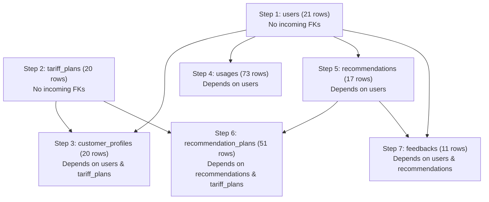

# SmartTariff — Complete Database Migration Analysis
**SQLite (`smarttariff.db`) ➔ PostgreSQL (`Prisma ORM`)**

---

## Executive Summary
This document delivers Phase 1 of the SmartTariff migration: **Database Migration Analysis Only**.
Every table, column, constraint, index, relationship, and record in the live SQLite database (`smarttariff.db`) has been physically inspected and audited against SQLAlchemy models and FastAPI database initialization routines.

No existing files, databases, frontend code, backend code, or ML models were altered.

---

## Section A: Existing SQLite Schema

The active SQLite database (`smartTariff-backend-main/smarttariff.db`) contains **7 core relational tables**. Below is the exact schema definition retrieved directly from SQLite `sqlite_master`:

### 1. `users`
```sql
CREATE TABLE users (
    id INTEGER NOT NULL, 
    name VARCHAR(100) NOT NULL, 
    email VARCHAR(255) NOT NULL, 
    password VARCHAR(255) NOT NULL, 
    phone VARCHAR(20), 
    role VARCHAR(20), 
    avatar VARCHAR(500), 
    is_active BOOLEAN, 
    created_at DATETIME, 
    updated_at DATETIME, 
    PRIMARY KEY (id)
);
CREATE UNIQUE INDEX ix_users_email ON users (email);
```

### 2. `customer_profiles`
```sql
CREATE TABLE customer_profiles (
    id INTEGER NOT NULL, 
    user_id INTEGER NOT NULL, 
    current_plan_id INTEGER, 
    monthly_budget FLOAT, 
    minimum_data FLOAT, 
    minimum_call_minutes FLOAT, 
    minimum_sms FLOAT, 
    requires_5g BOOLEAN, 
    preferred_operator VARCHAR(50), 
    created_at DATETIME, 
    updated_at DATETIME, 
    preferred_duration VARCHAR(50) DEFAULT '28', 
    PRIMARY KEY (id), 
    FOREIGN KEY(user_id) REFERENCES users (id), 
    FOREIGN KEY(current_plan_id) REFERENCES tariff_plans (id)
);
CREATE UNIQUE INDEX ix_customer_profiles_user_id ON customer_profiles (user_id);
```

### 3. `tariff_plans`
```sql
CREATE TABLE tariff_plans (
    id INTEGER NOT NULL, 
    plan_code VARCHAR(50), 
    name VARCHAR(150) NOT NULL, 
    operator VARCHAR(50), 
    category VARCHAR(50), 
    price FLOAT NOT NULL, 
    monthly_equivalent FLOAT, 
    duration_months INTEGER, 
    validity INTEGER NOT NULL, 
    data_limit FLOAT, 
    call_minutes FLOAT, 
    sms_limit FLOAT, 
    offer_type VARCHAR(50), 
    individual_cost FLOAT, 
    discount_inr FLOAT, 
    discount_percent FLOAT, 
    five_g BOOLEAN, 
    description TEXT, 
    benefits TEXT, 
    image VARCHAR(500), 
    popularity INTEGER, 
    is_active BOOLEAN, 
    created_at DATETIME, 
    updated_at DATETIME, 
    PRIMARY KEY (id)
);
CREATE INDEX ix_tariff_plans_is_active ON tariff_plans (is_active);
```

### 4. `usages`
```sql
CREATE TABLE usages (
    id INTEGER NOT NULL, 
    customer_id INTEGER NOT NULL, 
    data_usage FLOAT NOT NULL, 
    call_minutes FLOAT NOT NULL, 
    sms_count FLOAT NOT NULL, 
    number_of_calls INTEGER, 
    average_call_duration FLOAT, 
    month VARCHAR(7) NOT NULL, 
    created_at DATETIME, 
    updated_at DATETIME, 
    PRIMARY KEY (id), 
    FOREIGN KEY(customer_id) REFERENCES users (id)
);
CREATE INDEX ix_usages_customer_id ON usages (customer_id);
```

### 5. `recommendations`
```sql
CREATE TABLE recommendations (
    id INTEGER NOT NULL, 
    customer_id INTEGER NOT NULL, 
    input_snapshot TEXT, 
    generated_by VARCHAR(20), 
    generated_at DATETIME, 
    created_at DATETIME, 
    updated_at DATETIME, 
    PRIMARY KEY (id), 
    FOREIGN KEY(customer_id) REFERENCES users (id)
);
CREATE INDEX ix_recommendations_customer_id ON recommendations (customer_id);
```

### 6. `recommendation_plans`
```sql
CREATE TABLE recommendation_plans (
    id INTEGER NOT NULL, 
    recommendation_id INTEGER NOT NULL, 
    plan_id INTEGER NOT NULL, 
    rank INTEGER NOT NULL, 
    score FLOAT NOT NULL, 
    reasons TEXT, 
    PRIMARY KEY (id), 
    FOREIGN KEY(recommendation_id) REFERENCES recommendations (id) ON DELETE CASCADE, 
    FOREIGN KEY(plan_id) REFERENCES tariff_plans (id)
);
CREATE INDEX ix_recommendation_plans_recommendation_id ON recommendation_plans (recommendation_id);
```

### 7. `feedbacks`
```sql
CREATE TABLE feedbacks (
    id INTEGER NOT NULL, 
    customer_id INTEGER NOT NULL, 
    recommendation_id INTEGER NOT NULL, 
    rating INTEGER NOT NULL, 
    comment VARCHAR(1000), 
    created_at DATETIME, 
    updated_at DATETIME, 
    PRIMARY KEY (id), 
    FOREIGN KEY(customer_id) REFERENCES users (id), 
    FOREIGN KEY(recommendation_id) REFERENCES recommendations (id)
);
CREATE INDEX ix_feedbacks_customer_id ON feedbacks (customer_id);
```

---

## Section B: PostgreSQL Target Schema

The target PostgreSQL schema is defined in `backend-node/prisma/schema.prisma` with exact relational mapping:

```sql
-- PostgreSQL DDL Equivalent

CREATE TYPE "Role" AS ENUM ('customer', 'admin');

CREATE TABLE "users" (
    "id" SERIAL PRIMARY KEY,
    "name" VARCHAR(100) NOT NULL,
    "email" VARCHAR(255) NOT NULL UNIQUE,
    "password" VARCHAR(255) NOT NULL,
    "phone" VARCHAR(20) DEFAULT '',
    "role" "Role" NOT NULL DEFAULT 'customer',
    "avatar" VARCHAR(500),
    "is_active" BOOLEAN NOT NULL DEFAULT true,
    "created_at" TIMESTAMPTZ NOT NULL DEFAULT CURRENT_TIMESTAMP,
    "updated_at" TIMESTAMPTZ NOT NULL DEFAULT CURRENT_TIMESTAMP
);

CREATE TABLE "tariff_plans" (
    "id" SERIAL PRIMARY KEY,
    "plan_code" VARCHAR(50),
    "name" VARCHAR(150) NOT NULL,
    "operator" VARCHAR(50) DEFAULT '',
    "category" VARCHAR(50) DEFAULT 'Standard',
    "price" DOUBLE PRECISION NOT NULL,
    "monthly_equivalent" DOUBLE PRECISION,
    "duration_months" INTEGER DEFAULT 1,
    "validity" INTEGER NOT NULL,
    "data_limit" DOUBLE PRECISION,
    "call_minutes" DOUBLE PRECISION,
    "sms_limit" DOUBLE PRECISION,
    "offer_type" VARCHAR(50) DEFAULT 'Standalone',
    "individual_cost" DOUBLE PRECISION,
    "discount_inr" DOUBLE PRECISION DEFAULT 0.0,
    "discount_percent" DOUBLE PRECISION DEFAULT 0.0,
    "five_g" BOOLEAN DEFAULT false,
    "description" TEXT DEFAULT '',
    "benefits" TEXT DEFAULT '[]',
    "image" VARCHAR(500),
    "popularity" INTEGER DEFAULT 0,
    "is_active" BOOLEAN DEFAULT true,
    "created_at" TIMESTAMPTZ DEFAULT CURRENT_TIMESTAMP,
    "updated_at" TIMESTAMPTZ DEFAULT CURRENT_TIMESTAMP
);
CREATE INDEX "ix_tariff_plans_is_active" ON "tariff_plans" ("is_active");

CREATE TABLE "customer_profiles" (
    "id" SERIAL PRIMARY KEY,
    "user_id" INTEGER NOT NULL UNIQUE REFERENCES "users"("id") ON DELETE CASCADE,
    "current_plan_id" INTEGER REFERENCES "tariff_plans"("id") ON DELETE SET NULL,
    "monthly_budget" DOUBLE PRECISION DEFAULT 500,
    "minimum_data" DOUBLE PRECISION DEFAULT 10,
    "minimum_call_minutes" DOUBLE PRECISION DEFAULT 500,
    "minimum_sms" DOUBLE PRECISION DEFAULT 100,
    "preferred_duration" VARCHAR(50) DEFAULT '28',
    "requires_5g" BOOLEAN DEFAULT false,
    "preferred_operator" VARCHAR(50) DEFAULT '',
    "created_at" TIMESTAMPTZ DEFAULT CURRENT_TIMESTAMP,
    "updated_at" TIMESTAMPTZ DEFAULT CURRENT_TIMESTAMP
);

CREATE TABLE "usages" (
    "id" SERIAL PRIMARY KEY,
    "customer_id" INTEGER NOT NULL REFERENCES "users"("id") ON DELETE CASCADE,
    "data_usage" DOUBLE PRECISION NOT NULL,
    "call_minutes" DOUBLE PRECISION NOT NULL,
    "sms_count" DOUBLE PRECISION NOT NULL,
    "number_of_calls" INTEGER DEFAULT 0,
    "average_call_duration" DOUBLE PRECISION DEFAULT 0,
    "month" VARCHAR(7) NOT NULL,
    "created_at" TIMESTAMPTZ DEFAULT CURRENT_TIMESTAMP,
    "updated_at" TIMESTAMPTZ DEFAULT CURRENT_TIMESTAMP
);
CREATE INDEX "ix_usages_customer_id" ON "usages" ("customer_id");

CREATE TABLE "recommendations" (
    "id" SERIAL PRIMARY KEY,
    "customer_id" INTEGER NOT NULL REFERENCES "users"("id") ON DELETE CASCADE,
    "input_snapshot" TEXT DEFAULT '{}',
    "generated_by" VARCHAR(20) DEFAULT 'rule-based',
    "generated_at" TIMESTAMPTZ DEFAULT CURRENT_TIMESTAMP,
    "created_at" TIMESTAMPTZ DEFAULT CURRENT_TIMESTAMP,
    "updated_at" TIMESTAMPTZ DEFAULT CURRENT_TIMESTAMP
);
CREATE INDEX "ix_recommendations_customer_id" ON "recommendations" ("customer_id");

CREATE TABLE "recommendation_plans" (
    "id" SERIAL PRIMARY KEY,
    "recommendation_id" INTEGER NOT NULL REFERENCES "recommendations"("id") ON DELETE CASCADE,
    "plan_id" INTEGER NOT NULL REFERENCES "tariff_plans"("id") ON DELETE CASCADE,
    "rank" INTEGER NOT NULL,
    "score" DOUBLE PRECISION NOT NULL,
    "reasons" TEXT DEFAULT '[]'
);
CREATE INDEX "ix_recommendation_plans_recommendation_id" ON "recommendation_plans" ("recommendation_id");

CREATE TABLE "feedbacks" (
    "id" SERIAL PRIMARY KEY,
    "customer_id" INTEGER NOT NULL REFERENCES "users"("id") ON DELETE CASCADE,
    "recommendation_id" INTEGER NOT NULL REFERENCES "recommendations"("id") ON DELETE CASCADE,
    "rating" INTEGER NOT NULL,
    "comment" VARCHAR(1000) DEFAULT '',
    "created_at" TIMESTAMPTZ DEFAULT CURRENT_TIMESTAMP,
    "updated_at" TIMESTAMPTZ DEFAULT CURRENT_TIMESTAMP
);
CREATE INDEX "ix_feedbacks_customer_id" ON "feedbacks" ("customer_id");
```

---

## Section C: SQLite ➔ PostgreSQL Datatype Mapping

| Entity | Field Name | SQLite Storage | Target PostgreSQL Type | Prisma Type | Reason / Transformation |
|---|---|---|---|---|---|
| **All** | `id` | `INTEGER PRIMARY KEY` | `SERIAL` (`INT4`) | `Int @id @default(autoincrement())` | Preserves existing integer sequences |
| **All** | `*_at` | `DATETIME` | `TIMESTAMPTZ` | `DateTime` | Native ISO-8601 with timezone support |
| **Users** | `email` | `VARCHAR(255)` | `VARCHAR(255)` | `String @db.VarChar(255)` | Indexed, unique, case-insensitive logic |
| **Users** | `role` | `VARCHAR(20)` | `Role` (`ENUM`) | `Role @default(customer)` | Strict DB-level enum integrity |
| **Users** | `is_active` | `BOOLEAN` (`0` or `1`) | `BOOLEAN` | `Boolean @default(true)` | SQLite integers convert to true boolean |
| **CustomerProfiles**| `requires_5g` | `BOOLEAN` (`0` or `1`) | `BOOLEAN` | `Boolean @default(false)` | Boolean conversion |
| **CustomerProfiles**| `monthly_budget`| `FLOAT` | `DOUBLE PRECISION` | `Float` | Exact IEEE 754 float representation |
| **TariffPlans** | `price` | `FLOAT` | `DOUBLE PRECISION` | `Float` | Currency amount |
| **TariffPlans** | `benefits` | `TEXT` | `TEXT` | `String @db.Text` | JSON array stored as string for exact compatibility |
| **TariffPlans** | `five_g` | `BOOLEAN` (`0` or `1`) | `BOOLEAN` | `Boolean @default(false)` | Boolean conversion |
| **Usages** | `month` | `VARCHAR(7)` | `VARCHAR(7)` | `String @db.VarChar(7)` | `YYYY-MM` month format |
| **Recommendations**| `input_snapshot`| `TEXT` | `TEXT` | `String @db.Text` | JSON snapshot stored as string |
| **RecommendationPlans**| `reasons` | `TEXT` | `TEXT` | `String @db.Text` | JSON string array of explainability text |

---

## Section D: Primary Keys

Every single table in the existing database uses a single-column auto-incrementing integer primary key named `id`:

| Table Name | Primary Key Column | Type | Autoincrement / Identity |
|---|---|---|---|
| `users` | `id` | `INTEGER` | `autoincrement()` |
| `customer_profiles` | `id` | `INTEGER` | `autoincrement()` |
| `tariff_plans` | `id` | `INTEGER` | `autoincrement()` |
| `usages` | `id` | `INTEGER` | `autoincrement()` |
| `recommendations` | `id` | `INTEGER` | `autoincrement()` |
| `recommendation_plans` | `id` | `INTEGER` | `autoincrement()` |
| `feedbacks` | `id` | `INTEGER` | `autoincrement()` |

**Key Finding**: No composite primary keys exist. All primary keys can and will be preserved verbatim during migration.

---

## Section E: Foreign Keys

### Actual SQLite Foreign Key Audit

```text
Table: customer_profiles
  ├── FK: user_id         -> users(id)         [on_delete: NO ACTION, on_update: NO ACTION]
  └── FK: current_plan_id -> tariff_plans(id)  [on_delete: NO ACTION, on_update: NO ACTION]

Table: usages
  └── FK: customer_id     -> users(id)         [on_delete: NO ACTION, on_update: NO ACTION]

Table: recommendations
  └── FK: customer_id     -> users(id)         [on_delete: NO ACTION, on_update: NO ACTION]

Table: recommendation_plans
  ├── FK: recommendation_id -> recommendations(id) [on_delete: CASCADE, on_update: NO ACTION]
  └── FK: plan_id           -> tariff_plans(id)    [on_delete: NO ACTION, on_update: NO ACTION]

Table: feedbacks
  ├── FK: customer_id       -> users(id)            [on_delete: NO ACTION, on_update: NO ACTION]
  └── FK: recommendation_id -> recommendations(id)  [on_delete: NO ACTION, on_update: NO ACTION]
```

**Integrity Verification**: `PRAGMA foreign_key_check` executed on `smarttariff.db` returned **0 violations**. All foreign key pointers in the database are 100% clean and valid.

---

## Section F: Actual Relationships

### Clarification & Correction of Presumed Relationships
> [!IMPORTANT]
> **Schema Correction Notice**:
> In some conceptual overviews, it was assumed that `usages` stems from `customer_profiles`.
> **The actual database inspection proves that `usages.customer_id` points directly to `users.id`**, not `customer_profiles.id`.
> Similarly, `recommendations.customer_id` and `feedbacks.customer_id` point directly to `users.id`.
> Below is the **exact, verified relationship structure**:

```text
users (id)
  │
  ├── [1:1] ─── customer_profiles (user_id) ─── [N:1] ──> tariff_plans (id)
  │
  ├── [1:N] ─── usages (customer_id)
  │
  ├── [1:N] ─── recommendations (customer_id)
  │               │
  │               ├── [1:N CASCADE] ─── recommendation_plans (recommendation_id)
  │               │                           │
  │               │                           └── [N:1] ──> tariff_plans (id)
  │               │
  │               └── [1:N CASCADE] ─── feedbacks (recommendation_id)
  │                                           │
  └── [1:N] ──────────────────────────────────┘ (customer_id)
```

### Relationship Detail
1. **User to Profile**: One-to-One (`users.id` 1:1 `customer_profiles.user_id`). Each customer has at most one profile.
2. **Profile to Plan**: Many-to-One (`customer_profiles.current_plan_id` N:1 `tariff_plans.id`, nullable).
3. **User to Usage**: One-to-Many (`users.id` 1:N `usages.customer_id`). Customers log monthly telemetry entries.
4. **User to Recommendation**: One-to-Many (`users.id` 1:N `recommendations.customer_id`).
5. **Recommendation to RecommendationPlan**: One-to-Many (`recommendations.id` 1:N `recommendation_plans.recommendation_id`) with `CASCADE` delete.
6. **RecommendationPlan to TariffPlan**: Many-to-One (`recommendation_plans.plan_id` N:1 `tariff_plans.id`).
7. **User & Recommendation to Feedback**: Feedback belongs to both `users` (`customer_id`) and `recommendations` (`recommendation_id`).

---

## Section G: Constraints

| Constraint Name / Type | Table | Columns | Condition / Action |
|---|---|---|---|
| `PRIMARY KEY` | All 7 tables | `id` | Unique, Non-null |
| `UNIQUE` | `users` | `email` | Unique index `ix_users_email` |
| `UNIQUE` | `customer_profiles` | `user_id` | Unique index `ix_customer_profiles_user_id` |
| `FOREIGN KEY` | `customer_profiles` | `user_id` | References `users(id)` |
| `FOREIGN KEY` | `customer_profiles` | `current_plan_id`| References `tariff_plans(id)` |
| `FOREIGN KEY` | `usages` | `customer_id` | References `users(id)` |
| `FOREIGN KEY` | `recommendations` | `customer_id` | References `users(id)` |
| `FOREIGN KEY` | `recommendation_plans` | `recommendation_id`| References `recommendations(id)` `ON DELETE CASCADE` |
| `FOREIGN KEY` | `recommendation_plans` | `plan_id` | References `tariff_plans(id)` |
| `FOREIGN KEY` | `feedbacks` | `customer_id` | References `users(id)` |
| `FOREIGN KEY` | `feedbacks` | `recommendation_id` | References `recommendations(id)` |
| `NOT NULL` | `users` | `name`, `email`, `password` | Mandatory user credentials |
| `NOT NULL` | `tariff_plans` | `name`, `price`, `validity` | Mandatory plan parameters |
| `NOT NULL` | `usages` | `customer_id`, `data_usage`, `call_minutes`, `sms_count`, `month` | Mandatory telemetry entries |
| `NOT NULL` | `recommendation_plans` | `recommendation_id`, `plan_id`, `rank`, `score` | Mandatory ranking tuple |
| `NOT NULL` | `feedbacks` | `customer_id`, `recommendation_id`, `rating` | Mandatory feedback score |

---

## Section H: Indexes

### Actual SQLite Indexes
```text
Table: users
  └── ix_users_email                          (UNIQUE, columns: ['email'])

Table: customer_profiles
  └── ix_customer_profiles_user_id            (UNIQUE, columns: ['user_id'])

Table: tariff_plans
  └── ix_tariff_plans_is_active               (NON-UNIQUE, columns: ['is_active'])

Table: usages
  └── ix_usages_customer_id                   (NON-UNIQUE, columns: ['customer_id'])

Table: recommendations
  └── ix_recommendations_customer_id          (NON-UNIQUE, columns: ['customer_id'])

Table: recommendation_plans
  └── ix_recommendation_plans_recommendation_id (NON-UNIQUE, columns: ['recommendation_id'])

Table: feedbacks
  └── ix_feedbacks_customer_id                (NON-UNIQUE, columns: ['customer_id'])
```

All 7 indexes will be recreated in PostgreSQL to ensure identical query plan performance for customer lookups, recommendation history queries, plan filtering, and user authentication.

---

## Section I: Verified Existing Record Counts

The row counts were directly queried from `smarttariff.db`:

| Table Name | Expected Count | **Verified Count** | Discrepancy |
|---|---|---|---|
| `users` | 21 | **21** | None (Match) |
| `customer_profiles` | 20 | **20** | None (Match) |
| `tariff_plans` | 20 | **20** | None (Match) |
| `usages` | 73 | **73** | None (Match) |
| `recommendations` | 17 | **17** | None (Match) |
| `recommendation_plans` | 51 | **51** | None (Match) |
| `feedbacks` | 11 | **11** | None (Match) |

### Record Breakdown
* **Users**: 1 Administrator (`id=1`, `admin@smarttariff.com`) and 20 Customers (`id=2` to `21`).
* **Customer Profiles**: Exactly 20 profiles, mapping 1-to-1 to each of the 20 customers (`user_id=2` through `21`). The administrator has no customer profile.
* **Tariff Plans**: Exactly 20 active plans (`id=1` through `20`, plan codes `P01` through `P20`).
* **Usages**: 73 monthly telemetry records spanning customer usage across recent months.
* **Recommendations**: 17 historical recommendation batches generated by customers.
* **Recommendation Plans**: Exactly 51 records (each of the 17 recommendations has exactly 3 ranked plans: ranks 1, 2, and 3; $17 \times 3 = 51$).
* **Feedbacks**: 11 customer rating submissions evaluating recommendation results.

---

## Section J: Data Migration Order

To respect all foreign key dependencies and prevent constraint violations, tables must be loaded in the following **strict topological order**:



### Loading Sequence
1. **`users`** (Independent)
2. **`tariff_plans`** (Independent)
3. **`customer_profiles`** (Depends on `users.id` and `tariff_plans.id`)
4. **`usages`** (Depends on `users.id`)
5. **`recommendations`** (Depends on `users.id`)
6. **`recommendation_plans`** (Depends on `recommendations.id` and `tariff_plans.id`)
7. **`feedbacks`** (Depends on `users.id` and `recommendations.id`)

---

## Section K: Potential Migration Risks & Mitigations

### 1. Primary Key ID Preservation
* **Risk**: PostgreSQL `SERIAL` columns will by default generate new IDs ($1, 2, 3...$) on insert. If IDs are re-assigned, existing foreign key references and frontend references (`id=2`, `P07`) could drift.
* **Mitigation**: All records will be imported with **explicit original IDs** (`OVERRIDING SYSTEM VALUE` or direct `id` assignment in Prisma).

### 2. PostgreSQL Sequence Synchronization
* **Risk**: After importing explicit IDs, PostgreSQL internal sequences (`pg_get_serial_sequence`) remain at 1. The next `INSERT` by an application will fail with a `duplicate key value violates unique constraint` error.
* **Mitigation**: Run `SELECT setval(pg_get_serial_sequence('table_name', 'id'), coalesce(max(id), 1))` for all 7 tables immediately after data insertion.

### 3. Boolean Representation Drift
* **Risk**: SQLite stores booleans as `1` and `0`. PostgreSQL strictly enforces boolean primitives (`true`, `false`).
* **Mitigation**: ETL transform `Boolean(val)` applied on all boolean columns (`is_active`, `requires_5g`, `five_g`).

### 4. Datetime Formatting
* **Risk**: SQLite stores timestamps as arbitrary strings (`2026-08-15 14:22:10.123456`). PostgreSQL requires valid ISO-8601 formatting with timezone awareness.
* **Mitigation**: Convert strings to JavaScript `new Date(val).toISOString()` before inserting into Prisma.

### 5. String-Serialized JSON Arrays
* **Risk**: Columns `benefits`, `input_snapshot`, and `reasons` are stored as JSON strings in SQLite. If parsed incorrectly, data could be corrupted.
* **Mitigation**: Keep them as `String @db.Text` in Prisma schema, ensuring byte-level parity with SQLite without schema conversion hurdles.

---

## Section L: Prisma Schema Decisions

1. **Naming Conventions**:
   * Prisma models use **PascalCase** (`User`, `CustomerProfile`, `TariffPlan`).
   * Database table names use **snake_case** via `@@map("users")`, `@@map("customer_profiles")`.
   * Model fields use **camelCase** (`monthlyBudget`, `callMinutes`, `isActive`) while mapping to database snake_case via `@map("monthly_budget")`. This automatically bridges the gap between PostgreSQL conventions and the React frontend requirements.
2. **Enum for User Roles**:
   * Defined `enum Role { customer admin }`. Enforces security constraints at the database engine level.
3. **Cascade Deletes**:
   * Configured `onDelete: Cascade` on `recommendation_plans` to match existing SQLite behavior (`ON DELETE CASCADE`).
   * Configured `onDelete: Cascade` on `customer_profiles`, `usages`, `recommendations`, and `feedbacks` when a user account is deleted, matching the FastAPI `/users/me` delete logic.
4. **Float Precision**:
   * Mapped `FLOAT` columns to Prisma `Float` (`DOUBLE PRECISION` in PostgreSQL), preserving exact floating-point metrics for ML feature engineering.

---

## Section M: PostgreSQL Sequence Realignment Script

Immediately after data migration, the following SQL statements must be executed on PostgreSQL:

```sql
SELECT setval(pg_get_serial_sequence('users', 'id'), (SELECT COALESCE(MAX(id), 1) FROM users));
SELECT setval(pg_get_serial_sequence('tariff_plans', 'id'), (SELECT COALESCE(MAX(id), 1) FROM tariff_plans));
SELECT setval(pg_get_serial_sequence('customer_profiles', 'id'), (SELECT COALESCE(MAX(id), 1) FROM customer_profiles));
SELECT setval(pg_get_serial_sequence('usages', 'id'), (SELECT COALESCE(MAX(id), 1) FROM usages));
SELECT setval(pg_get_serial_sequence('recommendations', 'id'), (SELECT COALESCE(MAX(id), 1) FROM recommendations));
SELECT setval(pg_get_serial_sequence('recommendation_plans', 'id'), (SELECT COALESCE(MAX(id), 1) FROM recommendation_plans));
SELECT setval(pg_get_serial_sequence('feedbacks', 'id'), (SELECT COALESCE(MAX(id), 1) FROM feedbacks));
```

---
*Database Migration Analysis verified against live SQLite database `smarttariff.db`.*
